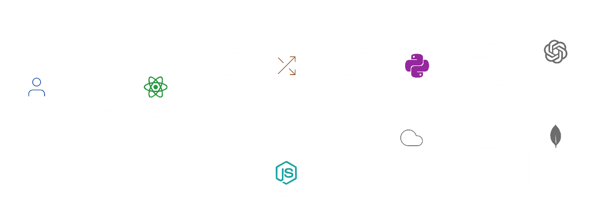

# FolkloreGPT: AI-Powered Indigenous Storyteller

**🎯 Hackathon Theme:** AI/ML (Natural Language Processing, Cultural Preservation)

## 📖 Problem Statement

Indigenous folklore, oral histories, and native languages are disappearing rapidly. Most existing digital archives are static and fail to capture the living, narrative nature of these traditions. They lack interaction, cultural context, and accessibility for younger generations.

## 💡 Solution Overview

*FolkloreGPT* is an AI-powered storytelling platform designed to preserve, generate, and share culturally grounded folklore narratives. The system combines a robust data collection pipeline with a scalable AI architecture to ensure stories remain authentic, contextual, and engaging.

Our approach prioritizes *responsible AI* by building on structured, community-sourced data rather than unverified text generation.

### Phase 1 Focus
- Built *FolkloreBase*, a full-stack folklore data collection system
- Enabled text, audio, and image uploads
- Designed metadata-rich storage for future AI training

### Phase 2 Focus
- Integrated AI story generation
- Designed complete system architecture
- Deployed live backend services
- Planned scalability, reliability, and real-world execution

## 🧱 System Architecture

### High-Level Architecture
The platform follows a *dual-backend architecture* to separate data ingestion from AI processing.

*Components:*
- React Frontend
- Node.js Data Ingestion Service
- Python FastAPI AI Service
- MongoDB Database
- Cloudinary Media Storage
- Railway Cloud Deployment

### 🔹 Frontend (React.js)
- Story submission interface  
- Media upload forms  
- AI story generation UI  
- Communicates with backend services via REST APIs  

### 🔹 Backend 1: Node.js Data Ingestion Service
*Responsibilities:*
- Handles multipart uploads (text, audio, images)  
- Uses multer for file handling  
- Uploads media to Cloudinary CDN  
- Stores structured metadata in MongoDB  
- Implements validation and error handling to prevent data loss  

*Why separate?*  
Ensures uninterrupted folklore data collection even if AI services are updated or redeployed.

### 🔹 Backend 2: Python FastAPI AI Service
*Responsibilities:*
- Hosts AI inference endpoints  
- Loads transformer models at startup  
- Exposes /api/generate and /api/health endpoints  
- Designed for future fine-tuning and RAG integration  

FastAPI was chosen for its async performance, clarity, and suitability for ML workloads.

## 🔄 Data Flow

1. User submits folklore content via frontend  
2. Node.js server processes uploads  
3. Media stored on Cloudinary  
4. Metadata stored in MongoDB  
5. AI service retrieves curated or generated stories  
6. Generated output returned to frontend  

This pipeline ensures clean separation between *data integrity* and *AI experimentation*.

### 📊 System Diagrams

*Diagram showing data flow through our system*

This diagram illustrates FolkloreGPT’s dual-backend data flow, where Node.js handles reliable data input and media storage, while FastAPI manages AI inference and story generation. This separation ensures scalability, stability, and safe AI experimentation.

## 🧠 AI Model Strategy

### Current Implementation
- *Model:* distilgpt2  
- Chosen for low memory footprint and fast inference  
- Suitable for hackathon deployment constraints  

### Future Strategy
- Fine-tune flan-t5-base on curated folklore data  
- Implement *Retrieval-Augmented Generation (RAG)* to:  
  - Ground outputs in real folklore  
  - Reduce hallucinations  
  - Preserve cultural accuracy  

Fallback logic ensures curated stories are served if AI inference fails.

## 📈 Scalability & Reliability Plan

### Handling Increased User Load
- Stateless backend services enable horizontal scaling  
- Media served via Cloudinary CDN  
- Database indexing on frequently queried fields  

### Performance Optimization
- AI models loaded once at startup  
- Async FastAPI endpoints  
- Cached folklore embeddings for RAG queries  

### Failure Recovery
- Health check endpoints for monitoring  
- Graceful degradation to curated story mode  
- Database retry mechanisms  
- Independent backend services prevent cascading failures  

## ☁️ Deployment Details
FolkloreGPT is deployed and fully functional with real AI story generation.

### **Live Backend API **
- **URL:** `https://folkloregpt-production.up.railway.app/api/`
- **Status:** ✅ **AI Model Enabled** (distilgpt2)
- **Health Check:** `GET /api/` returns `{"message": "Hello World", "mongodb": true, "ai_model": true}`

### ☁️ Configuration

- **Platform:** Railway (Free Tier)  
- **Memory:** 512MB RAM  
- **AI Mode:** Curated + DistilGPT-2  
- **Production Toggle:** `ai_model_loaded = true`  

Memory-optimized deployment ensures reliable availability during evaluation.

### 🛣️ Execution Roadmap

#### **Phase 1 – Data Foundation (Completed)**
- Developed **FolkloreBase**, a robust platform for structured folklore collection  
- Handled text, audio, and image uploads with metadata  
- Designed MongoDB schema for cultural context and story metadata  
- Stored media in Cloudinary for reliability and scalability  

#### **Phase 2 – AI Integration & Deployment (Completed)**
- Integrated transformer-based AI model (`distilgpt2`) for story generation  
- Built AI endpoints with FastAPI (`/api/generate` and `/api/health`)  
- Maintained dual-backend architecture for stability and separation of concerns  
- Deployed live backend on Railway with health checks and memory optimization  
- Implemented fallback to curated stories to ensure reliability  
- Demonstrated fully functional end-to-end workflow in a 3-minute demo  

#### **Phase 3 – Advanced Intelligence & Scale (Post-Hackathon)**
- Fine-tuning larger instruction models (e.g., `flan-t5`) on curated folklore  
- Implementing **Retrieval-Augmented Generation (RAG)** for grounded outputs  
- Adding text-to-speech for spoken-word folklore  
- Enabling multilingual story generation  
- Containerizing the system with Docker for cloud deployment and autoscaling  

> **Note:** Phases 1 and 2 are fully implemented and demonstrated, while Phase 3 are planned enhancements.
